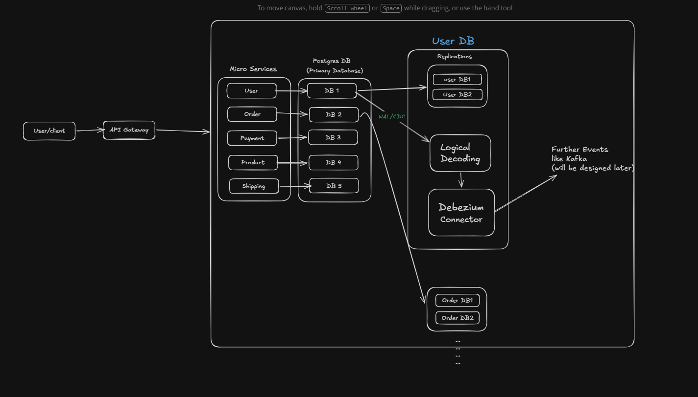
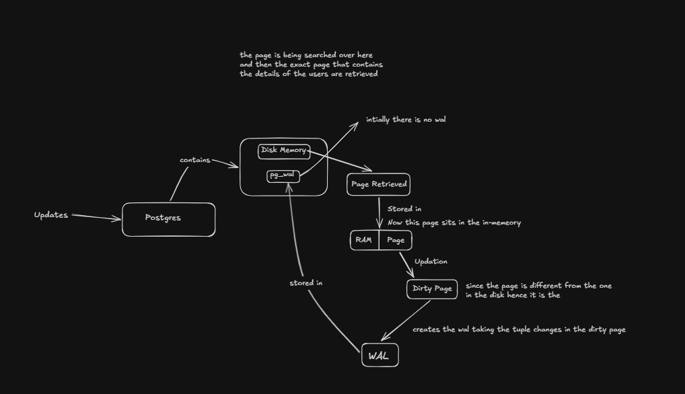
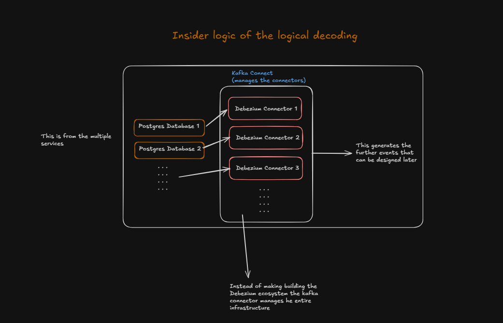
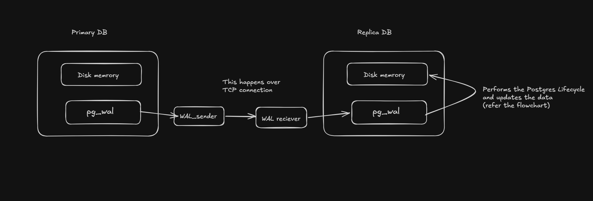
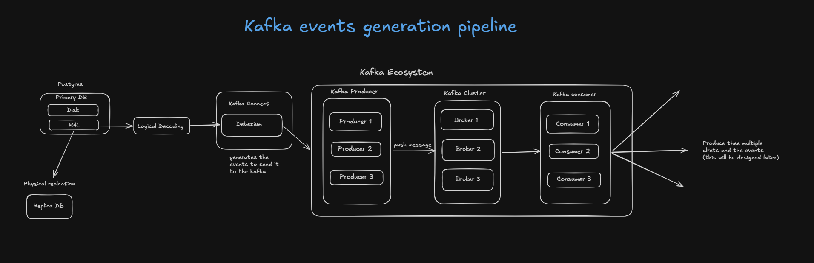

# CDC Mutation Tracker

A real-time database mutation tracking pipeline built with Spring Boot. Detects every INSERT, UPDATE, and DELETE in PostgreSQL, computes field-level diffs, routes changes by semantic type, and generates AI-powered human readable audit logs.

---

## What Problem Does This Solve

In microservice architectures, database changes happen constantly. When a user's email changes, their billing address is updated, or a payment amount is modified — downstream services need to know. Traditional approaches like polling the database every few seconds are wasteful, miss changes, and don't tell you *what* changed.

This project reads directly from PostgreSQL's Write-Ahead Log (WAL) via Debezium — the same mechanism PostgreSQL uses internally for replication. Every change is captured the moment it happens, with full before and after state, and routed intelligently based on what changed.

---

## Architecture

### System Overview
> How microservices connect to the CDC pipeline



### WAL Internals
> How PostgreSQL writes to WAL before flushing dirty pages to disk



### Logical Decoding
> How Kafka Connect manages multiple Debezium connectors across databases



### Physical Replication
> WAL sender and receiver over TCP between primary and replica



### Kafka Events Pipeline
> Full flow from WAL through Debezium into Kafka brokers and consumers



---

## How It Works

```
PostgreSQL row changes
        ↓
WAL (wal_level=logical)
        ↓
Debezium reads WAL via logical decoding
        ↓
Kafka topic — before/after JSON event
        ↓
Spring Boot CDCConsumer (@KafkaListener)
        ↓
DiffEngine — field by field comparison
        ↓
SchemaTagConfig — tag each field (pii / financial / operational)
        ↓
EventRouter
  ├── PII change       → Kafka: privacy-alerts topic
  ├── Financial change → Kafka: financial-audit topic
  ├── Any change       → Groq API → human readable audit log → PostgreSQL
  └── Any change       → Redis cache invalidation
```

---

## Key Design Decisions

**Why WAL instead of application-level events?**
Application events require developers to remember to fire them. WAL captures everything at the database level — no changes can be missed, even from direct SQL or database migrations.

**Why `REPLICA IDENTITY FULL`?**
By default PostgreSQL WAL does not store old row values on UPDATE. Without this setting, the `before` field in Debezium events is always null — making field-level diffing impossible.

**Why `auto.commit=false` on the Kafka consumer?**
Offset is committed only after every step succeeds — diff, route, audit log save, cache invalidation. If the app crashes mid-processing, Kafka replays the message on restart. No change event is ever lost.

**Why `REQUIRES_NEW` transaction on audit log save?**
Isolates the audit log save from the Kafka listener's transaction context, ensuring the commit happens immediately and independently.

**Why fallback log generation?**
If Groq API is unavailable, the pipeline must not stop. A fallback log is generated from the raw diff and saved — the audit trail is always preserved.

---

## Tech Stack

| Component | Technology |
|---|---|
| Core framework | Spring Boot 3.2.5, Java 21 |
| CDC | Debezium 2.4 (PostgreSQL connector) |
| Event streaming | Apache Kafka |
| Primary database | PostgreSQL 15 |
| Cache | Redis 7 |
| AI audit logs | Groq API (llama-3.1-8b-instant) |
| Metrics | Prometheus + Micrometer |
| Containerization | Docker Compose |

---

## Project Structure

```
src/main/java/com/cdc/mutation_tracker/
├── consumer/
│   └── CDCConsumer.java          # Kafka listener, orchestrates the pipeline
├── engine/
│   ├── DiffEngine.java           # Field-level before/after comparison
│   └── DebeziumTypeDecoder.java  # Decodes Base64 encoded NUMERIC types
├── config/
│   ├── SchemaTagConfig.java      # Loads schema-tags.yml, provides getTag()
│   ├── KafkaConfig.java          # Consumer/producer beans, manual commit
│   └── RedisConfig.java          # RedisTemplate bean
├── router/
│   └── EventRouter.java          # Routes diff results to topics/audit/cache
├── audit/
│   ├── AuditLogService.java      # Calls Groq API, saves to PostgreSQL
│   └── AuditLogRepository.java   # JPA repository
├── cache/
│   └── CacheInvalidator.java     # Deletes Redis keys on change
├── model/
│   ├── DebeziumEvent.java        # Maps raw Kafka JSON
│   ├── FieldChange.java          # Single field change with tag
│   ├── DiffResult.java           # Output of DiffEngine
│   └── AuditLog.java             # JPA entity
└── exception/
    └── MalformedEventException.java  # Triggers dead letter queue routing
```

---

## Prerequisites

- Java 21
- Maven
- Docker Desktop
- Groq API key — get one free at https://console.groq.com

---

## Running Locally

### Step 1: Clone and configure

```bash
git clone https://github.com/sujay-777/mutation-tracker.git
cd mutation-tracker
```

Create `src/main/resources/application-local.yml`:

```yaml
spring:
  config:
    activate:
      on-profile: local

groq:
  api:
    key: your_groq_api_key_here
    model: llama-3.1-8b-instant
```

### Step 2: Start infrastructure

```bash
docker-compose up -d
```

Wait 30 seconds for all containers to start.

Verify everything is running:

```bash
docker-compose ps
```

You should see 6 containers up: `postgres`, `zookeeper`, `kafka`, `debezium`, `redis`, `kafka-ui`.

### Step 3: Create database tables

```bash
docker exec -it postgres psql -U postgres -d testdb
```

```sql
CREATE TABLE users (
    id SERIAL PRIMARY KEY,
    name VARCHAR(100),
    email VARCHAR(100),
    balance NUMERIC
);

ALTER TABLE users REPLICA IDENTITY FULL;

CREATE TABLE audit_log (
    id BIGSERIAL PRIMARY KEY,
    table_name VARCHAR(100),
    row_id VARCHAR(100),
    operation VARCHAR(10),
    changed_fields TEXT,
    human_readable_log TEXT,
    tags VARCHAR(100),
    created_at TIMESTAMP
);

\q
```

### Step 4: Register Debezium connector

**On Mac/Linux:**
```bash
curl -X POST http://localhost:8083/connectors \
  -H "Content-Type: application/json" \
  -d '{
    "name": "pg-connector",
    "config": {
      "connector.class": "io.debezium.connector.postgresql.PostgresConnector",
      "database.hostname": "postgres",
      "database.port": "5432",
      "database.user": "postgres",
      "database.password": "password",
      "database.dbname": "testdb",
      "topic.prefix": "cdc",
      "table.include.list": "public.users",
      "plugin.name": "pgoutput"
    }
  }'
```

**On Windows PowerShell:**
```powershell
$body = '{"name":"pg-connector","config":{"connector.class":"io.debezium.connector.postgresql.PostgresConnector","database.hostname":"postgres","database.port":"5432","database.user":"postgres","database.password":"password","database.dbname":"testdb","topic.prefix":"cdc","table.include.list":"public.users","plugin.name":"pgoutput"}}'

Invoke-RestMethod -Method Post -Uri http://localhost:8083/connectors -ContentType "application/json" -Body $body
```

### Step 5: Run the Spring Boot app

In IntelliJ — Run `MutationTrackerApplication`.

Or via Maven:
```bash
mvn spring-boot:run
```

> **Windows note:** If you have PostgreSQL installed locally, it may conflict on port 5432. The Docker PostgreSQL is mapped to port 5433. Ensure your `application.yml` datasource URL uses `127.0.0.1:5433` and not `localhost:5433` to avoid IPv6 routing issues.

---

## Testing the Pipeline

### Insert a row

```sql
INSERT INTO users (name, email, balance)
VALUES ('Arjun', 'arjun@gmail.com', 5000);
```

### Update a field

```sql
UPDATE users SET email = 'new@gmail.com' WHERE id = 1;
```

### Check the audit log

```sql
SELECT id, table_name, row_id, operation, human_readable_log, tags
FROM audit_log
ORDER BY created_at DESC
LIMIT 10;
```

**Expected output for UPDATE:**
```
operation | human_readable_log                                              | tags
----------+-----------------------------------------------------------------+-----
UPDATE    | User record (ID: 1) was updated: email changed from             | pii
          | arjun@gmail.com to new@gmail.com.                               |
```

---

## Monitoring

| URL | What you see |
|---|---|
| `http://localhost:8080` | Kafka UI — topics, messages, consumer lag |
| `http://localhost:8081/actuator/health` | App health |
| `http://localhost:8081/actuator/prometheus` | Prometheus metrics |

---

## Schema Tag Configuration

Tags are defined in `src/main/resources/application.yml` under `schema-tags`. No code changes needed to add new tables or tag new columns.

```yaml
schema-tags:
  tables:
    users:
      columns:
        email: pii
        name: pii
        balance: financial
    orders:
      columns:
        amount: financial
        status: operational
        user_id: pii
```

| Tag | Behaviour |
|---|---|
| `pii` | Routed to `privacy-alerts` Kafka topic |
| `financial` | Routed to `financial-audit` Kafka topic |
| `operational` | Audit log only |
| `untagged` | Audit log only |

---

## Edge Cases Handled

- `REPLICA IDENTITY FULL` required for UPDATE before state — error thrown with clear message if missing
- Same-value updates (no-op) — detected and skipped, no false alerts
- Debezium `VariableScaleDecimal` (Base64 encoded NUMERIC) — decoded to `BigDecimal` before comparison
- Snapshot reads on Debezium startup (`op=r`) — ignored, not treated as real changes
- Groq API failure — fallback log generated, pipeline never blocked
- Malformed Kafka messages — routed to dead letter queue (`audit.dead-letter` topic), offset committed so pipeline moves on
- Redis failure — logged and skipped, never stops the main pipeline

---

## Stopping

```bash
docker-compose down
```

To also clear all data:

```bash
docker-compose down -v
```

---

## What's Next

- Prometheus + Grafana dashboard showing audit log counts, PII alert rates, consumer lag
- REST endpoints: `GET /audit-logs/{table}`, `GET /impact/{table}`
- Multi-table support via dynamic Debezium connector registration
- K6 load testing to validate pipeline throughput under high write volume
